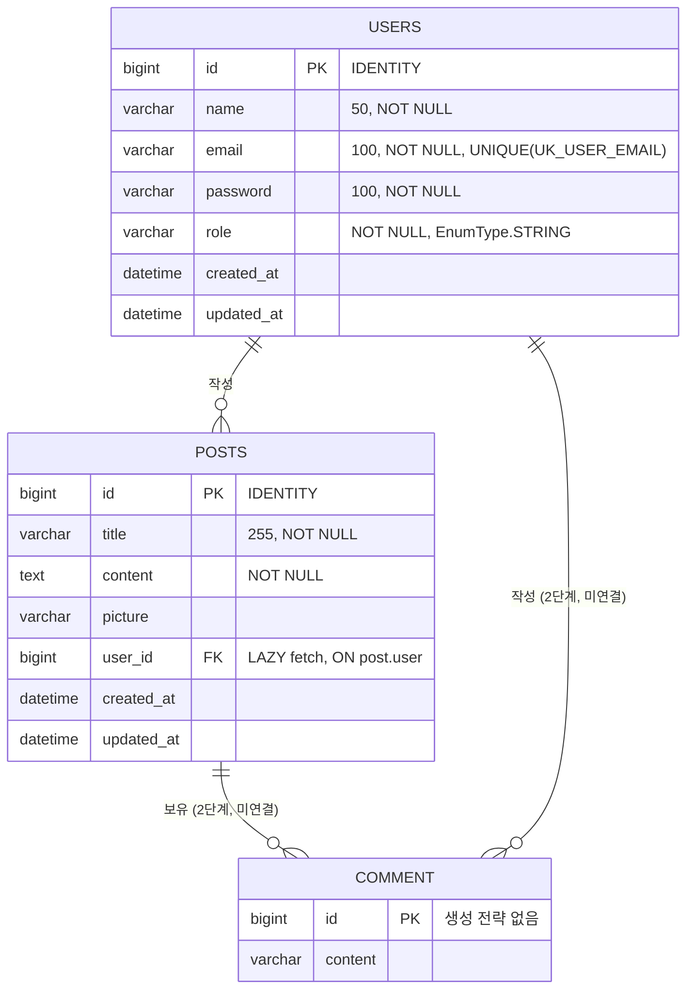

# 03. 도메인 모델

> **2026-09-09 업데이트**: 이 문서는 구현 전 분석 시점 기준이다. `User`/`Post`의 "발견된 문제" 대부분은
> P0+P1 구현으로 해결되었다(각 항목에 ✅ 표시). ERD·DDL의 컬럼 정의(길이, 유니크 제약, `fetch` 전략)는
> 실제 반영된 값으로 갱신했다. `Comment`는 최초 범위(P0/P1) 밖이었으나 2026-09-10 P3 작업으로
> 완성되었다(3.6절 참고).

## 3.1 ERD



## 3.2 BaseEntity

```java
@Getter
@MappedSuperclass
@EntityListeners(AuditingEntityListener.class)
public abstract class BaseEntity {
    @CreatedDate      private LocalDateTime createdAt;
    @LastModifiedDate private LocalDateTime updatedAt;
}
```

- `@MappedSuperclass`: 별도 테이블 없이 자식 엔티티 테이블에 `created_at`, `updated_at` 컬럼으로 상속됩니다.
- `@EntityListeners(AuditingEntityListener.class)`: Spring Data JPA Auditing 리스너를 등록합니다.

### [치명적] `@EnableJpaAuditing` 누락

`@CreatedDate` / `@LastModifiedDate`는 **`@EnableJpaAuditing`이 활성화되어야만 값이 채워집니다.**
현재 프로젝트 어디에도 이 애노테이션이 없어, 두 필드는 항상 `null`로 저장됩니다.

권장 해결책은 별도 설정 클래스를 두는 것입니다. `KraftApplication`에 직접 붙이면
`@WebMvcTest` 등 슬라이스 테스트에서 `JpaMetamodelMappingContext` 빈을 요구해 테스트가 깨집니다.

```java
package com.kraft.config;

@Configuration
@EnableJpaAuditing
public class JpaConfig {
}
```

### 개선 여지

- `createdAt`은 갱신되면 안 되므로 `@Column(updatable = false)`를 권장합니다.
- `@Column(nullable = false)`를 추가하면 DDL 수준에서 감사 필드의 누락을 조기에 발견할 수 있습니다.

## 3.3 User

```java
@Getter @NoArgsConstructor
@Entity @Table(name = "users")
public class User extends BaseEntity {
    @Id @GeneratedValue(strategy = GenerationType.IDENTITY)
    private Long id;

    @Column(nullable = false) private String name;
    @Column(nullable = false) private String email;
    @Column(nullable = false) private String password;

    @Enumerated(EnumType.STRING)
    @Column(nullable = false) private Role role;

    @OneToMany(mappedBy = "user")
    private List<Post> posts;

    public String getRoleKey() { return this.role.getKey(); }
}
```

### 분석

| 항목 | 평가 |
| --- | --- |
| `@Table(name = "users")` | `user`는 H2/MariaDB 모두에서 예약어이므로 복수형 사용은 **적절한 선택**입니다. |
| `@Enumerated(EnumType.STRING)` | `ORDINAL`이 아닌 `STRING` 사용은 **모범 사례**입니다. enum 상수 순서 변경에 안전합니다. |
| `getRoleKey()` | Spring Security의 `ROLE_` 접두사 규약과 어댑팅하는 편의 메서드로 적절합니다. |
| `@NoArgsConstructor` | JPA 요구사항 충족. 다만 `access = AccessLevel.PROTECTED`로 제한해 외부의 무분별한 생성을 막는 편이 좋습니다. |

### 발견된 문제 (해결 현황)

1. ✅ **해결** — **`email` 유니크 제약 없음**
   `@Table(name = "users", uniqueConstraints = @UniqueConstraint(name = "UK_USER_EMAIL", columnNames = "email"))`로 반영했다. H2 콘솔에서 제약 생성 확인 완료.

2. ✅ **해결** — **컬럼 길이 미지정**
   `name` 50자, `email`/`password` 100자로 지정했다.

3. ✅ **해결** — **생성자 / 정적 팩터리 부재**
   `@Builder`가 붙은 `User(String name, String email, String password, Role role)` 생성자를 추가했다.
   `UserService.signUp()`이 이를 사용해 회원가입을 구현한다.

4. ✅ **해결** — **비밀번호 변경 메서드 부재**
   `changePassword(String encodedPassword)`, `promoteToUser()`를 추가했다. `promoteToUser()`는
   현재 `UserService`에만 존재하고 컨트롤러에는 노출하지 않는다(실제 이메일 인증 토큰/발송은 P3 범위).

5. ✅ **해결(2026-09-09)** — **`@OneToMany posts`의 실효성**
   양방향 연관관계의 역방향인데 연관관계 편의 메서드도, 사용처도 없었다. 게시글 목록은
   `PostRepository`로 조회하는 편이 N+1과 메모리 측면에서 유리해, 이 필드를 실제로 제거했다.
   제거 전 `grep -rn "getPosts()\|\.posts\b" src/`로 프로젝트 어디서도 참조하지 않음을
   확인했다([08장 8.12절](08-issues-and-todo.md#812-추가-구현-p2-1p2-6p2-7p2-9p2-11-나머지-정리-2026-09-09) 참고).

6. **미해결(P2) — `@Getter`가 `password`까지 노출**
   엔티티를 그대로 직렬화하면 비밀번호 해시가 응답에 포함됩니다. 현재 컨트롤러는 `User` 엔티티를
   직접 반환하지 않고 DTO(record)만 응답하므로 실제 유출 경로는 없지만, 엔티티 자체의 방어 설계는
   아니라는 점은 그대로 남아 있다.

## 3.4 Role

```java
@Getter @RequiredArgsConstructor
public enum Role {
    ADMIN("ROLE_ADMIN", "관리자"),
    USER("ROLE_USER", "일반 사용자"),
    GUEST("ROLE_GUEST", "손님");

    private final String key;
    private final String title;
}
```

- `key`는 Spring Security의 권한 문자열, `title`은 화면 표기용입니다. 설계가 명확합니다.
- 기획상 흐름은 **가입 시 `GUEST` → 이메일 인증 시 `USER`**입니다. `ADMIN`은 별도 부여 경로가 필요합니다.
- 현재 Lombok 미동작으로 이 enum이 **컴파일 실패의 직접 원인** 중 하나입니다
  ([02장 2.3절](02-build-and-dependencies.md) 참고).

## 3.5 Post

```java
@Entity @NoArgsConstructor
@Table(name = "posts")
public class Post extends BaseEntity {
    @Id @GeneratedValue(strategy = GenerationType.IDENTITY)
    private Long id;

    @Column(length = 255, nullable = false) private String title;
    @Column(columnDefinition = "TEXT", nullable = false) private String content;

    private String picture;   // 사진등록 타입이 String가 맞나요?

    @ManyToOne
    @JoinColumn(name = "user_id")
    private User user;
}
```

### 발견된 문제 (해결 현황)

1. ✅ **해결** — **`@Getter` 누락**
   `Post` 클래스에 `@Getter`를 추가했다.

2. ✅ **해결** — **`@ManyToOne` 즉시 로딩**
   `fetch = FetchType.LAZY`로 변경하고, `PostRepository.findAllDesc()`를 `JOIN FETCH p.user`로
   바꿔 N+1 없이 목록을 조회하도록 확인했다(`bootRun` 후 실제 SQL 로그로 검증).
   `nullable = false`는 이번 범위에서는 추가하지 않았다(작성자 없는 레거시 데이터 이관 시나리오를
   배제하지 않기 위함 — 필요 시 P2에서 검토).

3. **미해결(P2) — `columnDefinition = "TEXT"`의 이식성**
   H2와 MariaDB 모두 `TEXT`를 인식하지만 `columnDefinition`은 DB 방언에 종속적입니다.
   JPA 표준인 `@Lob` 또는 `@Column(length = 65535)` 사용이 이식성 측면에서 안전합니다.

4. **답변 반영 완료 — `picture` 필드**

   > `// 사진등록 타입이 String가 맞나요?`

   **`String`이 맞습니다.** 타입은 그대로 유지했고, `PostSaveRequestDto.picture`도 nullable로
   구현해 실제 파일 업로드 없이도 등록이 가능하도록 했다. ✅ **2026-09-09 추가**: 컬럼 길이도
   `@Column(length = 500)`으로 명시했다(기본 255 → 500, P2-9 해결). ✅ **2026-09-10 추가**:
   실제 업로드/저장소 연동도 구현했다 — `PostImageService`가 로컬 디스크에 저장하고 `/images/**`로
   서빙하는 URL을 `picture`에 담는다. 상세는
   [08장 8.14절](08-issues-and-todo.md#814-추가-구현-p3-5-게시글-사진-업로드--p3-9-비밀번호-변경-화면-2026-09-10) 참고.

5. ✅ **해결** — **비즈니스 메서드 부재**
   `update(String title, String content)`를 추가했다. `picture`는 수정 대상에서 제외했다
   (`index.js`의 수정 요청이 `title`/`content`만 전송하므로 스펙과 일치시킴).

6. ✅ **해결** — **생성자 / `@Builder` 부재**
   `@Builder`가 붙은 `Post(String title, String content, String picture, User user)` 생성자를
   추가했다. `PostSaveRequestDto.toEntity(User user)`가 이를 사용한다.

## 3.6 Comment — ✅ 구현 완료 (2026-09-10)

> 이 절은 구현 전(2단계 골격) 상태를 그대로 남겨두고, 실제 반영 내용을 아래에 추가했다.
> 상세 검증은 [09장](09-implementation-summary.md), P3 진행 기록은
> [08장 8.13절](08-issues-and-todo.md#813-추가-구현-p3-댓글comment-기능--회원가입-화면-2026-09-10) 참고.

구현 전 골격:

```java
@Getter @NoArgsConstructor
@Entity @Table(name = "comment")
public class Comment {
    @Id private Long id;
    private String content;
}
```

현재는 골격만 존재하며 다음이 모두 누락되어 있었다.

| 누락 항목 | 영향 | 해결 여부 |
| --- | --- | --- |
| `@GeneratedValue` | ID를 애플리케이션이 직접 채워야 하며, 미지정 시 저장 실패 | ✅ 해결 |
| `extends BaseEntity` | 작성/수정 시각이 기록되지 않음 | ✅ 해결 |
| `Post` 연관관계 | 어느 게시글의 댓글인지 알 수 없음 | ✅ 해결 |
| `User` 연관관계 | 작성자를 알 수 없어 수정/삭제 권한 검증 불가 | ✅ 해결 |
| `CommentRepository` | 조회 수단 없음 | ✅ 해결 |
| 테이블명 | `posts`, `users`가 복수형이므로 `comments`로 통일 권장 | ✅ 해결 |

### 실제 구현 (`domain/comment/Comment.java`)

```java
@Getter
@Entity
@NoArgsConstructor
@Table(name = "comments")
public class Comment extends BaseEntity {

    @Id
    @GeneratedValue(strategy = GenerationType.IDENTITY)
    private Long id;

    @Column(columnDefinition = "TEXT", nullable = false)
    private String content;

    @ManyToOne(fetch = FetchType.LAZY)
    @JoinColumn(name = "post_id")
    private Post post;

    @ManyToOne(fetch = FetchType.LAZY)
    @JoinColumn(name = "user_id")
    private User user;

    @Builder
    public Comment(String content, Post post, User user) {
        this.content = content;
        this.post = post;
        this.user = user;
    }

    public void update(String content) {
        this.content = content;
    }
}
```

**2단계 참고 형태와 다른 점**: `@NoArgsConstructor(access = AccessLevel.PROTECTED)` 대신
`Post`/`User`(기존 도메인 클래스들)와 동일하게 `@NoArgsConstructor`(기본 접근자)를 사용해 스타일을
통일했다. `post_id`/`user_id`에 `nullable = false`를 붙이지 않았다 — `Post.user`도 같은 이유로
`nullable` 미지정 상태(작성자 없는 레거시 데이터 이관 시나리오를 배제하지 않기 위함, 03장 3.5절과
동일 판단).

### CommentRepository

```java
public interface CommentRepository extends JpaRepository<Comment, Long> {

    @Query("SELECT c FROM Comment c JOIN FETCH c.user WHERE c.post.id = :postId ORDER BY c.id ASC")
    List<Comment> findAllByPostIdAsc(@Param("postId") Long postId);
}
```

`PostRepository.findAllDesc()`와 같은 `JOIN FETCH` 패턴으로 N+1을 방지한다. `Post`와 달리
게시글당 댓글 수가 적다고 가정해 `Page` 없이 `List`를 그대로 반환한다(페이징은 P3 범위에서 명시적으로 제외).

**검증(`CommentRepositoryTest`, `@DataJpaTest`)**: 특정 게시글의 댓글만 id 오름차순으로 조회되고
다른 게시글 댓글은 제외됨, `JOIN FETCH`로 `em.clear()` 이후에도 지연로딩 예외 없이 작성자 접근 가능,
`BaseEntity` 감사 필드(`createdAt`) 자동 채움을 모두 확인했다.

## 3.7 리포지토리

### PostRepository — ✅ JOIN FETCH 적용 완료

```java
public interface PostRepository extends JpaRepository<Post, Long> {
    @Query("SELECT p FROM Post p JOIN FETCH p.user ORDER BY p.id DESC")
    List<Post> findAllDesc();
}
```

`Post.user`를 `LAZY`로 바꾸면서 함께 `JOIN FETCH`로 변경해 N+1 없이 작성자명을 조회한다(4절 검증 완료).

- **개선점(P2)**: 쿼리 메서드 `findAllByOrderByIdDesc()`로도 동일한 결과를 얻을 수 있어 `@Query`가 불필요하지만, `JOIN FETCH`가 필요한 이상 명시적 JPQL을 유지하는 편이 의도가 분명하다.
- **개선점(P2)**: 게시글이 늘어나면 전체 조회는 위험합니다. `Page<Post> findAll(Pageable)` 기반 페이징 전환을 권장합니다.

### UserRepository — ✅ 구현 완료

```java
public interface UserRepository extends JpaRepository<User, Long> {
    Optional<User> findByEmail(String email);
    boolean existsByEmail(String email);
}
```

`findByEmail`은 `UserDetailsServiceImpl`(로그인)과 `PostService.save()`(작성자 조회)에서,
`existsByEmail`은 `UserService.signUp()`의 이메일 중복 검사에서 사용한다.

## 3.8 실제 생성된 DDL (H2, `ddl-auto: create-drop` 적용 후 확인)

`./gradlew bootRun` 기동 시 Hibernate 로그로 실제 실행된 DDL을 확인했다.

```sql
create table users (
    created_at timestamp(6),
    id bigint generated by default as identity,
    updated_at timestamp(6),
    name varchar(50) not null,
    email varchar(100) not null,
    password varchar(100) not null,
    role enum ('ADMIN','GUEST','USER') not null,
    primary key (id),
    constraint UK_USER_EMAIL unique (email)
)

create table posts (
    created_at timestamp(6),
    id bigint generated by default as identity,
    updated_at timestamp(6),
    user_id bigint,
    content TEXT not null,
    picture varchar(255),   -- 2026-09-09 이후 @Column(length = 500)으로 varchar(500) 반영(P2-9)
    title varchar(255) not null,
    primary key (id)
)

alter table if exists posts
    add constraint FK5lidm6cqbc7u4xhqpxm898qme
    foreign key (user_id) references users

create table comment (
    id bigint not null,
    content varchar(255),
    primary key (id)
)
```

컬럼 길이·유니크 제약이 3.3절 수정 사항대로 반영되었다. `comment` 테이블은 최초 분석 시점 기준이며,
2026-09-10 이후 `comments`(복수형) 테이블로 완성되었다([3.6절](#36-comment--구현-완료-2026-09-10) 참고). `application.yml`의 `ddl-auto: create-drop` 설정은
[07. 설정과 실행](07-configuration.md)에서 확정했다.

## 3.9 EmailVerificationToken — ✅ 구현 완료 (2026-09-10)

회원가입 시 발급되는 이메일 인증 토큰. `User`가 `GUEST`에서 `USER`로 승격되기 전까지 유효하며,
사용(인증 완료) 또는 만료 시 삭제되는 일회용 토큰이다. `BaseEntity`는 상속하지 않는다 — 생성 시각은
`expiresAt` 자체로 충분하고 수정 개념이 없는 일회용 엔티티라 `updatedAt`이 불필요하기 때문이다.

```java
@Entity
@Table(name = "email_verification_tokens")
public class EmailVerificationToken {
    @Id @GeneratedValue(strategy = GenerationType.IDENTITY)
    private Long id;

    @Column(nullable = false, unique = true, length = 100)
    private String token;

    @ManyToOne(fetch = FetchType.LAZY)
    @JoinColumn(name = "user_id")
    private User user;

    @Column(nullable = false)
    private LocalDateTime expiresAt;

    public boolean isExpired() {
        return LocalDateTime.now().isAfter(expiresAt);
    }
}
```

`EmailVerificationTokenRepository`는 `findByToken(String token)` 하나만 제공한다. 구현 배경과
플로우 전체는 [08. 이슈와 할 일 8.15절](08-issues-and-todo.md)에 정리되어 있다.
