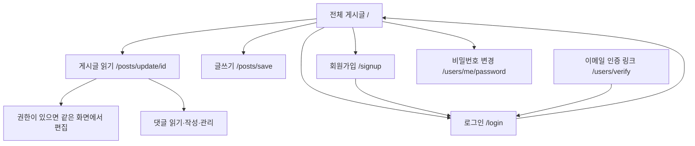

| 헤더 왼쪽 | Kraft | 항상 `/` — 목록으로 돌아가는 유일한 수단이다 |
| 헤더 오른쪽 | (이메일) | 로그인 시 표시만 |
| 헤더 오른쪽 | 글쓰기 | 로그인 시 `/posts/save` |
| 헤더 오른쪽 | 인증 메일 재발송 | GUEST 역할일 때 |
| 헤더 오른쪽 | 로그인 | 비로그인 시 `/login` |
| 헤더 오른쪽 | 회원가입 | 비로그인 시 `/signup` |
| 헤더 오른쪽 | 비밀번호 변경 | 로그인 시 `/users/me/password` |
| 헤더 오른쪽 | 로그아웃 | 로그인 시 기존 CSRF 폼 제출 |
# 03. 반응형 화면 명세

이 문서는 앞으로 구현할 화면을 정의한다. 현재 상태와의 차이는 [현재 스펙](01-current-spec.md), 파일별 작업은 [구현 계획](04-implementation-plan.md)을 참조한다.

## 1. 정보 구조와 이동

브랜드는 `Kraft`, 메인 게시판 이름은 `전체 게시글`로 통일한다. 현재 화면의 튜토리얼 제목과 영문 `Login`, `Logout`은 서비스명과 한국어 행동 라벨로 정리한다.

`id`는 기존 URL의 게시글 ID다. 별도 게시글 상세 URL을 신설하지 않는다. 글쓰기·비밀번호 변경 GET에 비로그인으로 접근하면 해당 화면 위치에서 로그인 안내를 제공한다. 저장 API의 인증 조건은 그대로 적용한다.

### 메뉴 구성

| 그룹 | 항목 | 노출 조건 / 목적지 |
| --- | --- | --- |
| 헤더 왼쪽 | Kraft | 항상 `/` — 목록으로 돌아가는 유일한 수단이다(별도 "전체 게시글" 항목은 두지 않는다) |
| 헤더 오른쪽 | (이메일) | 로그인 시, 표시 전용 |
| 헤더 오른쪽 | 글쓰기 | 로그인 시 `/posts/save` |
| 헤더 오른쪽 | 인증 메일 재발송 | GUEST 역할일 때 |
| 헤더 오른쪽 | 로그인 | 비로그인 시 `/login` |
| 헤더 오른쪽 | 회원가입 | 비로그인 시 `/signup` |
| 헤더 오른쪽 | 비밀번호 변경 | 로그인 시 `/users/me/password` |
| 헤더 오른쪽 | 로그아웃 | 로그인 시 기존 CSRF 폼 제출 |

**이동·계정 버튼은 헤더 오른쪽 한 곳에만 둔다.** 같은 행동을 본문에 다시 놓지 않는다(목록의 글쓰기 버튼, 오른쪽 안내 영역의 로그인·회원가입, 각 화면의 "로그인하러 가기"·"목록으로" 같은 중복은 두지 않는다). 본문에는 상황 안내 문구만 남기고, 폼 자체의 취소·저장 버튼과 페이지 이동(페이저)은 그대로 본문에 둔다.

로그인 상태에 이메일을 표시할 때는 헤더 오른쪽 버튼 모음 안에서 보여준다. 작성자 이름은 서버가 내려준 `author`를 그대로 사용한다. 프로필 페이지나 닉네임 수정 링크는 추가하지 않는다.

## 2. 화면 크기별 배치

기준은 CSS viewport 너비다. 기존 [Bootstrap 4.3의 분기점](https://getbootstrap.com/docs/4.3/layout/overview/)인 576·768·992·1200px에 맞춰 구성 요소의 변화를 정의한다.

| 너비 | 전체 게시글 화면 | 탐색 | 목록 / 여백 |
| --- | --- | --- | --- |
| 320~575px | 단일 열 | 헤더 메뉴 버튼으로 헤더 아래에 펼침 | 제목 위주 행, 좌우 16px, 패널 안쪽 16px |
| 576~767px | 단일 열 | 헤더 메뉴 버튼으로 헤더 아래에 펼침 | 제목+메타 행 유지, 폼 버튼은 공간에 따라 가로 정렬 |
| 768~991px | 본문 + 아래쪽 이용 안내 | 헤더 오른쪽 가로 한 줄(토글 숨김) | 열 정렬 목록, 좌우 24px, 패널 안쪽 24px |
| 992~1199px | 단일 본문 열 | 헤더 오른쪽 가로 한 줄 | 열 간격 24px, 이용 안내는 본문 아래 |
| 1200px 이상 | 가변 본문 + 안내 248px | 헤더 오른쪽 가로 한 줄 | 열 간격 24px, 컨테이너 최대 1280px |

1280px는 컨테이너의 내부 콘텐츠 최대 폭이며 바깥 여백은 별도다. 폭 1200px에서는 바깥 여백 48px를 제외한 1152px 안에 `880 + 24 + 248` 배치가 들어간다(탐색이 헤더로 올라가 왼쪽 192px 열이 없어졌다). Grid의 본문 열은 `minmax(0, 1fr)`, 내부 요소는 `min-width: 0`을 기준으로 한다.

상세·글쓰기 화면은 안내 열을 사용하지 않고 본문에 폭을 배분한다. 게시글 읽기 내용은 최대 800px, 편집·작성 패널은 최대 960px로 제한한다. 계정 화면은 사이드바 없이 최대 480px 폼을 중앙 배치한다.

### 공통 동작

- 모바일을 기본 스타일로 작성한 뒤 큰 화면 규칙을 추가한다.
- 모바일 헤더는 최소 56px 높이, 데스크톱은 최소 64px로 한다. 글자 확대 시 높이가 늘어날 수 있어야 한다.
- 메뉴는 헤더 아래에 펼쳐지는 영역으로 구현한다. 열림 상태는 `aria-expanded`, 대상은 `aria-controls`로 연결한다.
- 메뉴가 닫혀 있을 때 내부 링크가 탭 순서에 남지 않아야 한다. Escape로 닫고 메뉴 버튼으로 포커스를 돌려준다.
- 기본 메뉴는 본문 흐름을 밀어내는 방식으로 하여 오버레이·포커스 가두기 의존성을 줄인다.
- 992px 경계를 오갈 때 모바일 메뉴의 숨김 속성과 데스크톱 탐색 상태가 충돌하지 않아야 한다.
- 모바일에서 보조 안내는 본문 뒤로 이동한다. 핵심 목록 앞에 큰 안내 카드가 쌓이지 않도록 한다.
- 하단 고정 글쓰기 버튼은 기본안에 넣지 않는다. 본문·키보드·시스템 안전 영역의 겹침을 피하고 게시판 제목 옆에 주 행동을 제공한다.

## 3. 전체 게시글 `/`

### 구성

1. 공통 헤더와 탐색.
2. `전체 게시글` 제목, `총 N개` 표시, 로그인 상태의 `글쓰기` 버튼.
3. `최근 등록 순으로 게시글을 확인하세요.` 설명.
4. 게시글 목록.
5. 페이지 이동.
6. 넓은 화면의 안내 열 또는 작은 화면의 본문 아래 이용 안내.

안내 영역은 `글 작성 시 이미지 한 개를 첨부할 수 있습니다.`와 허용 형식·용량 안내 등 실제 기능을 설명한다. 비로그인 상태에서는 로그인·가입 링크를 제공한다. 접속자 수, 인기글, 내 작성글 수 등 제공되지 않는 데이터는 넣지 않는다.

### 목록 행

| 정보 | 768px 이상 | 768px 미만 |
| --- | --- | --- |
| 글 번호 | 첫 열, 약 64px | 메타 정보 앞에 `#123` 형태로 유지 |
| 제목 | 가변 폭, 두 줄까지 표시 | 첫 줄 영역, 두 줄까지 표시 |
| 작성자 | 약 120px, 긴 이름 줄바꿈 | 제목 아래 메타 정보 |
| 최종 수정일 | 약 144px, `YYYY.MM.DD HH:mm` | 메타 정보에서 줄바꿈 가능 |

시각적으로 두 줄을 넘는 제목을 줄여도 링크의 전체 텍스트와 접근 가능한 이름은 보존한다. 상세에서는 제목을 모두 보여준다. 작성자와 날짜는 작은 화면에서도 제거하지 않는다. 서버가 제공한 `LocalDateTime`을 임의로 UTC로 해석하지 않는다.

목록은 하나의 반복 데이터로 렌더링한다. 예를 들어 의미 있는 `ul/li` 안에 제목 링크와 메타 정보를 두고, 넓은 화면에서 CSS Grid로 열을 정렬할 수 있다. 데스크톱 표와 모바일 카드를 중복 렌더링하여 링크·ID·읽기 순서가 중복되지 않도록 한다.

### 페이지 이동과 빈 상태

- 768px 이상: `이전` + 현재 페이지 주변 연속 숫자 최대 5개 + `다음`.
- 768px 미만: `이전` + `현재 / 전체 페이지` + `다음`.
- 첫·마지막 페이지에서는 이동 불가 요소를 실제 링크로 출력하지 않는다. `disabled` 스타일만으로 클릭을 막지 않는다.
- 숫자는 1부터 표시하고 요청의 `page`는 0부터 전달한다.
- 전체 게시글이 0개이면 `아직 게시글이 없습니다.`와 로그인 상태에 맞는 글쓰기 또는 로그인 행동을 보여준다. `1 / 0` 페이지 표시는 하지 않는다.
- 게시글은 있으나 요청한 페이지가 비어 있으면 `이 페이지에 게시글이 없습니다.`와 `첫 페이지로 이동`을 보여준다.
- 현재 정렬은 게시글 ID 내림차순이다. `최신 수정 순`, 검색 결과, 인기순처럼 다른 의미를 부여하지 않는다.

## 4. 게시글 읽기·편집 `/posts/update/{id}`

### 읽기 기본 상태

목록으로 이동 → 전체 제목 → 작성자·글 번호 → 본문 → 첨부 이미지 → 관리 행동 → 댓글 순서로 배치한다. 상세 응답에 없는 작성·수정 시각은 표시하지 않는다.

본문은 사용자 입력을 이스케이프하여 출력하고 `white-space: pre-wrap`과 긴 문자열 줄바꿈을 적용한다. 현재 데이터는 일반 텍스트이므로 임의로 HTML·Markdown으로 렌더링하지 않는다. 이미지가 있으면 본문 폭 안에 원본 비율로 표시하고, 없으면 이미지 영역을 만들지 않는다.

비로그인·다른 작성자는 읽기 상태를 사용한다. 본인·관리자는 서버가 제공한 `canManagePost`가 참인 경우 `수정`, `삭제`를 볼 수 있다. 이 플래그는 **현재 없으며 구현 선행 작업**이다.

### 편집 상태

- `수정`을 누르면 같은 화면에서 제목·본문 폼을 연다. URL은 유지한다.
- 글 ID는 기존 JS가 사용할 수 있도록 숨김 필드로 유지한다. 작성자와 기존 이미지는 읽기 정보다.
- `저장`은 기존 PUT API로 제목·본문만 전송한다. 중복 제출은 막는다.
- `취소`는 서버에서 받은 원래 제목·본문으로 되돌리고 읽기 상태로 복귀한다. 변경 내용이 있으면 폐기 여부를 확인한다.
- 저장 실패 시 입력값과 편집 상태를 유지하고 오류를 표시한다.
- 저장 성공 후 기존 동작처럼 목록으로 이동하되 이동한 화면에서 성공 결과를 한 번 표시한다.
- 이미지 교체·삭제, 임시 저장, 리치 텍스트 도구 모음은 제공하지 않는다.

### 삭제

게시글과 댓글의 삭제 확인을 공통 모달로 구성하되 대상과 문구를 구분한다. 게시글은 `이 게시글을 삭제하시겠습니까?`, 댓글은 `이 댓글을 삭제하시겠습니까?`로 표시한다. 취소를 기본 포커스로 두고, 처리 중 중복 확인을 막는다.

게시글 삭제 성공은 목록으로 이동한다. 실패는 현재 내용을 유지한다. 현재 게시글 삭제 시 댓글 정리 정책은 서비스·DB에서 별도 검증이 필요하므로 `댓글까지 모두 삭제됩니다.`라고 선행 안내하지 않는다.

## 5. 댓글

댓글 제목에는 현재 로드한 댓글 배열의 개수를 사용할 수 있다. 이는 목록 API의 댓글 수 필드와 별개다.

| 상태 | 목표 화면 |
| --- | --- |
| 댓글 없음 | `첫 댓글을 남겨 보세요.` |
| 비로그인 | 댓글 목록과 `로그인 후 댓글을 작성할 수 있습니다.` 링크 |
| 로그인 | 라벨이 있는 본문 입력, `댓글 등록`, 처리·오류 상태 |
| 본인·관리자 댓글 | 서버의 `canManage`가 참일 때 `수정`, `삭제` |
| 댓글 편집 | 해당 댓글을 입력 폼으로 전환, `저장`, `취소` |

댓글 수정은 이미 존재하는 PUT API를 연결하는 UI 보완이다. 댓글마다 관리 가능 여부를 서버에서 제공해야 한다. 표시 이름끼리 비교하거나 브라우저에서 권한을 추정하지 않는다.

댓글 작성·수정 성공은 현재 페이지를 새로고침하여 서버 결과를 다시 받는 방식으로 시작할 수 있다. 이때 결과 메시지와 댓글 영역 복귀 정보를 한 번 전달한다. 실패 시 작성 내용은 남긴다. 댓글 삭제 모달을 닫으면 호출 버튼으로, 삭제 성공 후에는 댓글 제목 등 남아 있는 적절한 위치로 포커스를 이동한다.

전체 댓글 조회 계약을 유지한다. 더보기·무한 스크롤·댓글 검색은 새로운 계약 없이 붙이지 않는다.

## 6. 글쓰기 `/posts/save`

로그인 상태에서는 제목 → 본문 → 이미지 첨부 → 행동 순서의 폼을 제공한다. 작성자 입력 대신 `작성자는 로그인 계정으로 자동 지정됩니다.`를 안내한다. 비로그인 직접 접근에는 로그인 안내와 목록 이동을 제공한다.

| 요소 | 목표 |
| --- | --- |
| 제목 | 명시적 라벨, 필수 표시, 255자 안내와 클라이언트 제한 |
| 본문 | 라벨, 필수 표시, 모바일 최소 높이 240px·큰 화면 360px, 세로 크기 조절 가능 |
| 이미지 | `JPG, JPEG, PNG, GIF, WEBP · 최대 5MB · 1개` 안내 |
| 선택 결과 | 파일 이름·크기·로컬 미리보기, 제출 전 선택 해제 |
| 등록 중 | `이미지 업로드 중…` 다음 `게시글 등록 중…`, 중복 등록 방지 |
| 성공 | 목록으로 이동한 후 결과 표시 |
| 실패 | 제목·본문·선택 상태 유지, 실패 단계와 재시도 안내 |

5MB 안내를 적용하기 전에 multipart 파일·요청 제한과 배포 환경의 제한을 서비스 기준에 맞춰 확인한다. 실제 수신 제한과 안내가 일치해야 한다.

이미지 미리보기는 선택한 파일의 object URL을 사용하고 교체·해제·이탈 시 해제한다. 선택 해제는 아직 등록하지 않은 파일 선택을 없애는 동작이다.

업로드 성공 후 게시글 저장만 실패한 경우, 같은 화면의 재시도는 이미 받은 URL을 재사용한다. 파일을 바꾸면 저장용 URL 상태를 초기화한다. 현재 서버에는 업로드 취소·고아 파일 정리 API가 없으므로 서버 파일까지 삭제했다고 표시하지 않는다.

## 7. 계정 화면

### 로그인

중앙 폼에 이메일, 비밀번호, 로그인 버튼, 회원가입·목록 링크를 제공한다. 입력 필드의 `name=username`, `name=password`, CSRF 폼을 유지한다. 이메일에는 `autocomplete=username`, 비밀번호에는 `autocomplete=current-password`를 적용한다.

실패 시 폼 위에 지속적인 오류 요약을 표시한다. 성공 목적지는 현재 정책인 `/`다. `이전 글로 돌아갑니다.` 같은 보장되지 않는 안내는 하지 않는다.

### 회원가입

이름·이메일·비밀번호·비밀번호 확인을 세로로 배치한다. 비밀번호 규칙은 입력 전에 읽을 수 있게 한다. 별도 이메일 중복확인 버튼은 만들지 않는다.

가입 성공 후 로그인 화면에서 `가입이 완료되었습니다. 이메일 인증 안내를 확인해 주세요.`를 표시한다. 메일 수신을 확정하지 않는다. 가입 API가 메일 발송 실패를 구분하지 않으므로 `인증 메일이 정상 발송되었습니다.`라고 단정하지 않는다.

### 비밀번호 변경

현재 비밀번호와 새 비밀번호를 입력한다. 새 비밀번호 안내는 현재 API에 맞춰 `8자 이상`으로 표시한다. 성공 시 `비밀번호가 변경되었습니다. 다시 로그인해 주세요.`를 전달한다.

현재 로그아웃 복귀 정책으로 변경 화면에 돌아올 수 있다. 그 경우 비로그인 안내·로그인 링크가 보여야 한다. 성공 목적지를 로그인으로 고정하는 정책 변경은 별도 서버 작업이다.

### 이메일 인증 결과

성공은 `이메일 인증이 완료되었습니다.`로 표시하고 로그인 이동을 제공한다. 로그인 세션이 이미 있으면 계정 메뉴를 통해 로그아웃 후 다시 로그인할 수 있도록 안내한다.

실패는 링크가 유효하지 않거나 만료되었음을 명확하게 설명한다. 현재 재발송 API가 없으므로 재발송 버튼이나 확인되지 않은 고객센터 경로는 만들지 않는다. 기존 예외 문구의 `인증 메일을 다시 요청해 주세요.`는 제공되지 않는 행동을 안내하므로 화면 표시용 문구를 보완한다.

`GUEST`와 `USER`의 작성 권한을 달리하는 UX는 이번 기본안에 넣지 않는다. 인증 후 작성만 허용하려면 API의 역할 검사, 인증 상태 공급, 세션 갱신, 재발송 흐름을 함께 정의해야 한다.

## 8. 공통 상태와 접근성

| 상황 | 동작 기준 |
| --- | --- |
| 처리 중 | 해당 제출 버튼 비활성화, 진행 문구, `aria-busy`, 성공·실패 후 상태 복구 |
| 필수 입력 오류 | 라벨과 연결된 오류 문구, `aria-invalid`, 첫 오류로 포커스 |
| API 검증 오류 | `ProblemDetail.detail`을 지속적인 요약에 표시. 현재 응답은 필드별 구조가 아니므로 임의 파싱으로 필드를 추정하지 않음 |
| 인증 만료 | 로그인 응답으로 이동했거나 JSON 대신 로그인 HTML이 도착한 경우 성공으로 처리하지 않음. 입력 유지 후 로그인 링크 제공 |
| 403 | 권한 부족과 세션·CSRF 문제 가능성을 안내하고 재시도·로그인 선택 제공. 무조건 인증 만료로 단정하지 않음 |
| 네트워크·서버 실패 | 입력 유지, 재시도 가능, 민감한 서버 내부 내용 표시 금지 |
| 없는 게시글 | 화면용 오류 처리 보완 후 `게시글을 찾을 수 없습니다.`와 목록 이동 제공 |
| 이미지 불러오기 실패 | 텍스트 대체 안내, 본문과 댓글 계속 이용 가능 |
| 성공 후 이동 | 목적 화면에서 한 번 읽을 수 있는 결과 메시지, 오래된 메시지 재표시 방지 |

언어는 `lang=ko`, 화면당 하나의 `h1`, 의미에 맞는 `header/nav/main/aside/footer`를 사용한다. 본문 바로가기와 키보드 포커스 스타일을 제공한다. 토스트의 중첩된 live region은 정리하고 일반 성공은 `polite`, 즉시 주의가 필요한 오류만 `alert`로 구분한다.

본문·제목·파일 이름·이메일의 긴 문자열에 줄바꿈을 적용한다. 이미지에는 `max-width: 100%`와 자동 높이를 적용한다. 320 CSS px에서 내용과 기능을 잃지 않고 세로로 읽을 수 있어야 한다. 1280px 화면의 400% 확대도 점검한다. 기준: [W3C WCAG 2.2 — Reflow](https://www.w3.org/WAI/WCAG22/Understanding/reflow.html).

모바일 입력 글자는 최소 16px로 하고 브라우저 확대를 금지하지 않는다. 색만으로 선택·오류를 전달하지 않는다. 메뉴·모달·페이지 이동·파일 입력·댓글 편집은 키보드로 모두 사용할 수 있어야 한다.

## 지원 브라우저 범위 (2026-09-12 결정)

| 대상 | 범위 |
| --- | --- |
| 데스크톱 | Chrome·Edge 최신 2개 버전, Safari 15+ |
| 모바일 | **iOS 15+**, Android Chrome 최신 2개 버전 |

이 범위를 정한 이유와, 그에 따라 **하지 않기로 한 것**:

- **flexbox `gap`을 그대로 쓴다** — `style.css`에서 20곳이 쓰고 있고, Safari는 flex의 `gap`을 14.1부터 지원한다. iOS 15는 이 기준을 넘으므로 마진 폴백(`@supports not (gap: …)`)을 두지 않는다. iOS 14 이하를 다시 지원해야 한다면 이 폴백부터 추가해야 한다(없으면 버튼·메뉴·메타 정보가 간격 없이 붙는다).
- **CSS는 `:focus-visible`만 예외였다** — Safari는 15.4부터 지원해 iOS 15.0~15.3에서는 규칙 자체가 무시된다. 그 구간에서도 키보드 포커스 표시가 사라지지 않도록 `:focus` 폴백을 함께 둔다(아래 `style.css` 주석 참고). 이 밖에 `:has()`·컨테이너 쿼리·`dvh`·`aspect-ratio`·`accent-color` 등 iOS 15에서 동작하지 않는 기능은 코드에 없다(실측 스캔).
- **JS는 제약이 되지 않는다** — `index.js`는 ES5 + jQuery 3.3.1로 작성돼 있고 화살표 함수·`const`/`let`·`fetch`·옵셔널 체이닝을 쓰지 않는다. 사용 중인 최신 API는 `Element.closest()`(Safari 9+)와 `FormData`뿐이다.
- **빌드 단계가 없다** — CSS·JS를 정적 파일로 그대로 서빙하므로 browserslist·트랜스파일·자동 프리픽스가 개입하지 않는다. 즉 **여기 적은 범위가 곧 실제 하한**이며, 새 문법을 쓸 때는 직접 확인해야 한다.
